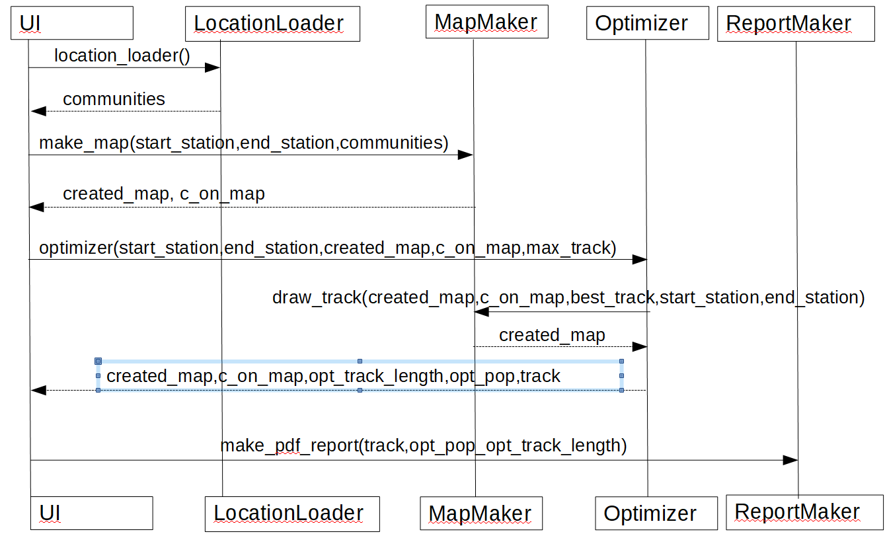

## Pakkauskaavio

## Sekvenssikaavio

UI käyttöliittymä hakee LocationLoaderin location_loader metodin avulla netistä Suomen kunnat sijaintitietoineen ja tiedostosta kuntien asukasmäärät. Se palauttaa nämä communities nimiseen pandas dataframeen.

Käyttäjä valitsee lähtö- ja pääteasemat (start_station ja end_station) sekä max radan pituuden (max_track_length). Nämä välitetään MapMakerille joka tekee kartasta numpy matriisiin (created_map) ja palauttaa myös listan kartalle jäävistä kunnista tietoineen (c_on_map).

UI ohjaa nämä tiedot Optimizerin optimizer metodille, joka antaa annetulle radanpituudelle mahdollisimman väestokattavan ratalinjauksen. optimizer-metodi kutsuu optimimoinnin jälkeen MapMakerin draw_map metodia, joka tekee radan (best_track) kartalle (created map). optimizer palauttaa UI:lle kartan (created_map), sillä olevat kunnat (c_on_map), optimoidun radan pituuden (opt_track_length), radan varrella asuvien asukasluvun (opt_pop) sekä saadun radan.

Käyttäjän pyytäessä raporttia UI kutsuu ReportMakerin make_pdf_report-metodia joka tekee saaduista tiedoista raportin hakemistoon data/reports. Kuva kartasta kierrätetään väliaikaisen tiedoston kautta.
