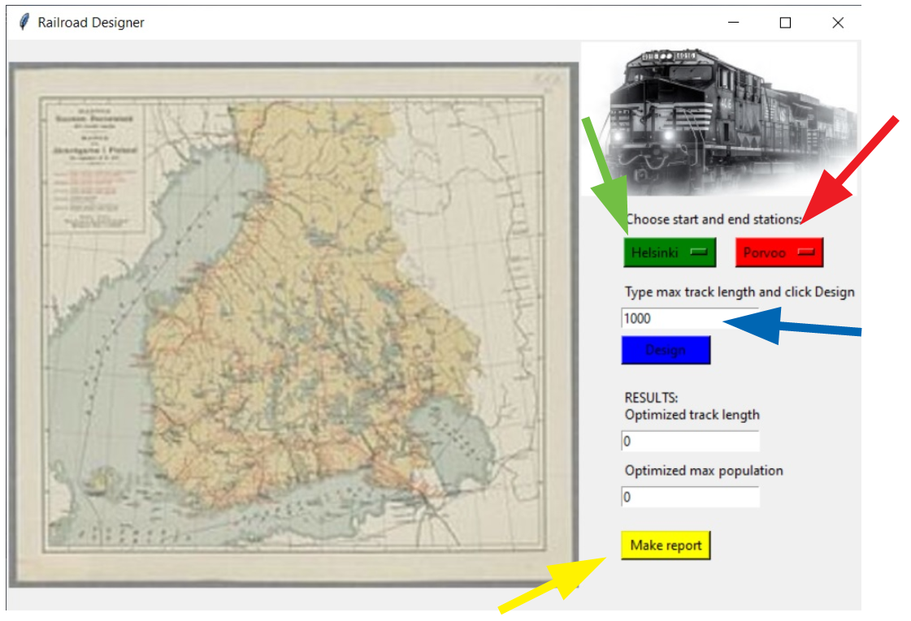

## Käyttöönotto

Lataa viimeisin release ja pura se sopivaan paikkaan.

Asenna tarvittavat riippuvuudet 
```bash
poetry install
```
Siirry 
```bash
poetry shell
```
Ja nyt voit käynnistää
```bash
poetry run invoke start
```

## Käyttö

Ohjelman käyttöliittymä näyttää tältä:


* Vihreällä nuolella valitaan lähtöasema
* Punaisella nuolella pääteasema
* Sinisen nuolen kohtaan kirjoitetaan maksimi radanpituus
* Rata optimoidaan mahdollisimman suurelle väkimäärälle painamalla keltaisen nuolen osoittamaa 'Design'-näppäintä

- Saatu tulos näkyy 'Optimized track length'-ruudussa

- 'Save track' tallettaa radan
- 'Load track' lataa aiemmin tehdyn radan
- 'Make report' tekee raportin