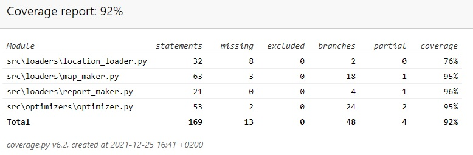

# Testausdokumentti

Ohjelma on testattu automatisoiduilla unittesteillä sekä manuaalisesti.

## Manuaalinen testaus

Ohjelmaan pystyy syöttämään manuaalisesti vain yhden arvon, radan pituuden. Tämän yritetään muuttaa ohjelmassa kokonaisluvuksi ja jos se ei onnistu, käytetään oletusarvoa 1000. Ohjelman on testattu eri lähtö- ja pääteasemilla eikä ohjelman varsinaisessa toimivuudessa ole havaittu puutteita. 

## Automaattinen testaus

Käyttöliittymän UI luokkaa lukuunottamatta ohjelman kaikille luokille LocLoader,MapMaker, ReportMaker ja Optimizer on kirjoitettu unitest-testit.

LocLoaderin testi testaa tietojen latautumisen onnistumisen. MapMaker vaatii myös LocLoaderin tuloksen testaukseensa ja Optimizer taas MapMakerin. ReportMakerin testaus tehdään luotavan aputiedoston avulla jonka ReportMaker oikein toimiessaan poistaa.

## Testauskattavuus

